# **Table of Contents**

* **Table of Contents**
{:toc}

--------------------------------------------------------------------------------------------------------------------
<div style="page-break-after: always;"></div>

# **Acknowledgements**

* `Task` and `Project` were inspired by AB3's `Person` object
* Commands from AB3 were brought over to `Task` and `Project`
* `ContainsNameIgnoreCase` method in `StringUtil` is inspired by [https://stackoverflow.com/questions/86780/](https://stackoverflow.com/questions/86780/)

--------------------------------------------------------------------------------------------------------------------

# **Setting up, getting started**

Refer to the guide [_Setting up and getting started_](SettingUp.md).

--------------------------------------------------------------------------------------------------------------------
<div style="page-break-after: always;"></div>

# **Design**

<div markdown="span" class="alert alert-primary">

:bulb: **Tip:** The `.puml` files used to create diagrams in this document can be found in the [diagrams](https://github.com/se-edu/addressbook-level3/tree/master/docs/diagrams/) folder. Refer to the [_PlantUML Tutorial_ at se-edu/guides](https://github.com/AY2223S1-CS2103T-T09-3/tp/tree/master/docs/diagrams) to learn how to create and edit diagrams.
</div>

## **Architecture**


The ***Architecture Diagram*** given above explains the high-level design of the App.

Given below is a quick overview of main components and how they interact with each other.

**Main components of the architecture**

**`Main`** has two classes called [`Main`](https://github.com/AY2223S1-CS2103T-T09-3/tp/blob/master/src/main/java/seedu/hrpro/Main.java) and [`MainApp`](https://github.com/AY2223S1-CS2103T-T09-3/tp/blob/master/src/main/java/seedu/hrpro/MainApp.java). It is responsible for,
* At app launch: Initializes the components in the correct sequence, and connects them up with each other.
* At shut down: Shuts down the components and invokes cleanup methods where necessary.

[**`Commons`**](#common-classes) represents a collection of classes used by multiple other components.

The rest of the App consists of four components.

* [**`UI`**](#ui-component): The UI of the App.
* [**`Logic`**](#logic-component): The command executor.
* [**`Model`**](#model-component): Holds the data of the App in memory.
* [**`Storage`**](#storage-component): Reads data from, and writes data to, the hard disk.


**How the architecture components interact with each other**

The *Sequence Diagram* below shows how the components interact with each other for the scenario where the user issues the command `delproj 1`.


Each of the four main components (also shown in the diagram above),

* defines its *API* in an `interface` with the same name as the Component.
* implements its functionality using a concrete `{Component Name} Manager` class which follows the corresponding API `interface` mentioned in the previous point.

For example, the `Logic` component defines its API in the `Logic.java` interface and implements its functionality using the `LogicManager.java` class which follows the `Logic` interface. Other components interact with a given component through its interface rather than the concrete class (reason: to prevent outside component's being coupled to the implementation of a component), as illustrated in the (partial) class diagram below.


The sections below give more details of each component.

<div style="page-break-after: always;"></div>

## **UI component**

The **API** of this component is specified in [`Ui.java`](https://github.com/AY2223S1-CS2103T-T09-3/tp/blob/master/src/main/java/seedu/hrpro/ui/Ui.java)

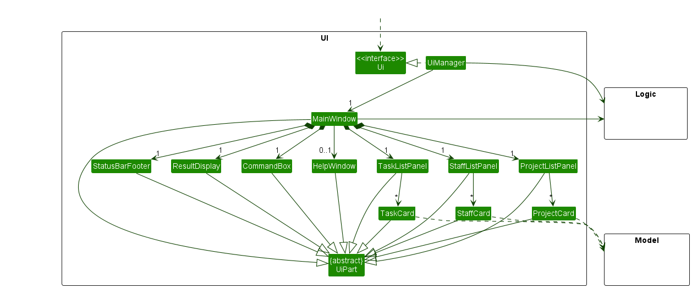

The UI consists of a `MainWindow` that is made up of parts e.g.`CommandBox`, `ResultDisplay`, `ProjectListPanel`, `StaffListPanel`, `TaskListPanel`, `StatusBarFooter` etc. All these, including the `MainWindow`, inherit from the abstract `UiPart` class which captures the commonalities between classes that represent parts of the visible GUI.

The `UI` component uses the JavaFx UI framework. The layout of these UI parts are defined in matching `.fxml` files that are in the `src/main/resources/view` folder. For example, the layout of the [`MainWindow`](https://github.com/AY2223S1-CS2103T-T09-3/tp/blob/master/src/main/java/seedu/hrpro/ui/MainWindow.java) is specified in [`MainWindow.fxml`](https://github.com/AY2223S1-CS2103T-T09-3/tp/blob/master/src/main/resources/view/MainWindow.fxml)

The `UI` component,

* executes user commands using the `Logic` component.
* listens for changes to `Model` data so that the UI can be updated with the modified data.
* keeps a reference to the `Logic` component, because the `UI` relies on the `Logic` to execute commands.
* depends on some classes in the `Model` component, as it displays objects such as `Project` residing in the `Model`.

### Current implementation
The GUI reflects the entered projects, tasks, and staff members recorded in HR Pro Max++.
There are 3 main columns, which from left to right are for `Task`, `Project` and `Staff` from model.
Directly adding or removing `Project`, `Task`, or `Staff` would update the `ProjectListPanel`, `TaskListPanel` and `StaffListPanel` to show their respective `ProjectCard`, `StaffCard` and `TaskCard` respectively.
Each of the `ProjectCard`, `StaffCard` and `TaskCard` would display the fields under the corresponding `Project`, `Staff` and `Task` objects as discussed under [Model Component](#model-component).


<div style="page-break-after: always;"></div>

## **Logic component**

**API** : [`Logic.java`](https://github.com/AY2223S1-CS2103T-T09-3/tp/blob/master/src/main/java/seedu/hrpro/logic/Logic.java)

Here's a (partial) class diagram of the `Logic` component:


How the `Logic` component works:
1. When `Logic` is called upon to execute a command, it uses the `HrProParser` class to parse the user command.
1. This results in a `Command` object (more precisely, an object of one of its subclasses e.g., `AddCommand`) which is executed by the `LogicManager`.
1. The command can communicate with `Model` when it is executed (e.g. to add a project).
1. The result of the command execution is encapsulated as a `CommandResult` object which is returned from `Logic`.

The Sequence Diagram below illustrates the interactions within the `Logic` component for the `execute("delproj 1")` API call.


<div markdown="span" class="alert alert-info">:information_source: **Note:** The lifeline for `DeleteCommandParser` should end at the destroy marker (X) but due to a limitation of PlantUML, the lifeline reaches the end of diagram.
</div>

Here are the other classes in `Logic` (omitted from the class diagram above) that are used for parsing a user command:


How the parsing works:
* When called upon to parse a user command, the `HrProParser` class creates an `XYZCommandParser` (`XYZ` is a placeholder for the specific command name e.g., `AddCommandParser`) which uses the other classes shown above to parse the user command and create a `XYZCommand` object (e.g., `AddCommand`) which the `HrProParser` returns back as a `Command` object.
* All `XYZCommandParser` classes (e.g., `AddCommandParser`, `DeleteCommandParser`, ...) inherit from the `Parser` interface so that they can be treated similarly where possible e.g, during testing.
* Note that the `XYZCommandParser` is only created for commands that require additional parameters to be taken in. 
Other commands (e.g., `ListCommand`, `Sort TaskCommand`) do not require any additional parameters and thus their parsing is handled by the `HrProParser` itself.

<div style="page-break-after: always;"></div>

## **Model component**
**API** : [`Model.java`](https://github.com/AY2223S1-CS2103T-T09-3/tp/blob/master/src/main/java/seedu/hrpro/model/Model.java)


The `Model` component,

* stores the data in HR Pro Max++ consisting of all `Project` and `Task` objects which are contained in their respective unique lists (e.g. `UniqueProjectList` object).
* stores the `UniqueStaffList` that contains only staff members belonging to the `Project` object that is being viewed (e.g. after a `ViewCommand`).
* stores the filtered `Project`, `Task` and `Staff` objects (e.g., results of a `FindCommand`) as a separate _filtered_ list which is exposed to outsiders as an unmodifiable `ObservableList<T>`, where `T` is either a `Project`, a `Task` or a `Staff` object, that can be 'observed' e.g. the UI can be bound to this list so that the UI automatically updates when the data in the list changes.
* stores a `UserPref` object that represents the user’s preferences. This is exposed to the outside as a `ReadOnlyUserPref` object.
* does not depend on any of the other three components (as the `Model` represents data entities of the domain, which should make sense on their own without depending on other components)


**API** : [`Project.java`](https://github.com/AY2223S1-CS2103T-T09-3/tp/blob/master/src/main/java/seedu/hrpro/model/project/Project.java)


The `Project` class,

* stores the details of a particular project (i.e. `ProjectName`, `Budget`, `Deadline`).
* stores the details of all Staff members (which are contained in a `UniqueStaffList` object) working on the project.

<div markdown="span" class="alert alert-info">:information_source: **Note:** The `UniqueStaffList` of a chosen `Project` object in HR Pro Max++ is copied over to the `UniqueStaffList` in `HrPro`, which is used to display the staff list shown to outsiders. The copying is done whenever the user edits the `UniqueStaffList` of the `Project` object being viewed (e.g. `AddStaffCommand`, `EditStaffCommand`) or when the user wants to view a different `Project` object (e.g. after a `ViewCommand`)
</div>


**API** : [`Staff.java`](https://github.com/AY2223S1-CS2103T-T09-3/tp/blob/master/src/main/java/seedu/hrpro/model/staff/Staff.java)


The `Staff` class,

* stores the details of a particular staff (e.g. `StaffName`, `StaffContact`, `StaffTitle`).

**API** : [`Task.java`](https://github.com/AY2223S1-CS2103T-T09-3/tp/blob/master/src/main/java/seedu/hrpro/model/task/Task.java)


The `Task` class,

* stores the details of a particular task (i.e. `TaskDescription`, `TaskDeadline`).

<div style="page-break-after: always;"></div>

## **Storage component**

**API** : [`Storage.java`](https://github.com/AY2223S1-CS2103T-T09-3/tp/blob/master/src/main/java/seedu/hrpro/storage/Storage.java)


The `Storage` component,
* can save both hr pro data and user preference data in json format, and read them back into corresponding objects.
* inherits from both `HrProStorage` and `UserPrefStorage`, which means it can be treated as either one (if the functionality of only one is needed).
* depends on some classes in the `Model` component (because the `Storage` component's job is to save/retrieve objects that belong to the `Model`)

## **Common classes**

Classes used by multiple components are in the `seedu.hrpro.commons` package.

--------------------------------------------------------------------------------------------------------------------
<div style="page-break-after: always;"></div>

# **Implementation**

This section describes some noteworthy details on how certain features are implemented.

## **\[Proposed\] Undo/redo feature**

### Proposed Implementation

The proposed undo/redo mechanism is facilitated by `VersionedHrPro`. It extends `HrPro` with an undo/redo history, stored internally as an `hrProStateList` and `currentStatePointer`. Additionally, it implements the following operations:

* `VersionedHrPro#commit()` — Saves the current hr pro state in its history.
* `VersionedHrPro#undo()` — Restores the previous hr pro state from its history.
* `VersionedHrPro#redo()` — Restores a previously undone hr pro state from its history.

These operations are exposed in the `Model` interface as `Model#commitHrPro()`, `Model#undoHrPro()` and `Model#redoHrPro()` respectively.

Given below is an example usage scenario and how the undo/redo mechanism behaves at each step.

Step 1. The user launches the application for the first time. The `VersionedHrPro` will be initialized with the initial hr pro state, and the `currentStatePointer` pointing to that single hr pro state.

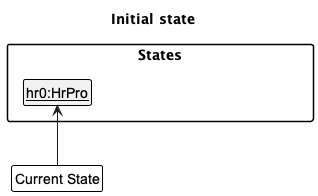

Step 2. The user executes `delproj 5` command to delete the 5th project in the hr pro. The `delproj` command calls `Model#commitHrPro()`, causing the modified state of the hr pro after the `delproj 5` command executes to be saved in the `hrProStateList`, and the `currentStatePointer` is shifted to the newly inserted hr pro state.


Step 3. The user executes `addproj pn/David …​` to add a new project. The `add` command also calls `Model#commitHrPro()`, causing another modified hr pro state to be saved into the `hrProStateList`.


<div markdown="span" class="alert alert-info">:information_source: **Note:** If a command fails its execution, it will not call `Model#commitHrPro()`, so the hr pro state will not be saved into the `hrProStateList`.

</div>

Step 4. The user now decides that adding the project was a mistake, and decides to undo that action by executing the `undo` command. The `undo` command will call `Model#undoHrPro()`, which will shift the `currentStatePointer` once to the left, pointing it to the previous hr pro state, and restores the hr pro to that state.

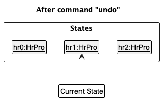

<div markdown="span" class="alert alert-info">:information_source: **Note:** If the `currentStatePointer` is at index 0, pointing to the initial HrPro state, then there are no previous HrPro states to restore. The `undo` command uses `Model#canUndoHrPro()` to check if this is the case. If so, it will return an error to the user rather
than attempting to perform the undo.

</div>

The following sequence diagram shows how the undo operation works:


<div markdown="span" class="alert alert-info">:information_source: **Note:** The lifeline for `UndoCommand` should end at the destroy marker (X) but due to a limitation of PlantUML, the lifeline reaches the end of diagram. This applies to all subsequent sequence diagrams.

</div>

The `redo` command does the opposite — it calls `Model#redoHrPro()`, which shifts the `currentStatePointer` once to the right, pointing to the previously undone state, and restores the hr pro to that state.

<div markdown="span" class="alert alert-info">:information_source: **Note:** If the `currentStatePointer` is at index `hrProStateList.size() - 1`, pointing to the latest hr pro state, then there are no undone HrPro states to restore. The `redo` command uses `Model#canRedoHrPro()` to check if this is the case. If so, it will return an error to the user rather than attempting to perform the redo.

</div>

Step 5. The user then decides to execute the command `list`. Commands that do not modify the hr pro, such as `list`, will usually not call `Model#commitHrPro()`, `Model#undoHrPro()` or `Model#redoHrPro()`. Thus, the `hrProStateList` remains unchanged.

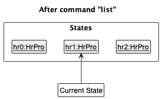

Step 6. The user executes `clear`, which calls `Model#commitHrPro()`. Since the `currentStatePointer` is not pointing at the end of the `hrProStateList`, all hr pro states after the `currentStatePointer` will be purged. Reason: It no longer makes sense to redo the `addproj pn/David …​` command. This is the behavior that most modern desktop applications follow.

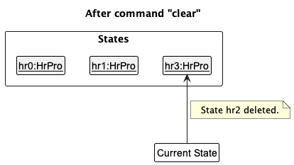

The following activity diagram summarizes what happens when a user executes a new command:


### Design considerations

**Aspect: How undo & redo executes:**

* **Alternative 1 (current choice):** Saves the entire hr pro.
  * Pros: Easy to implement.
  * Cons: May have performance issues in terms of memory usage.

* **Alternative 2:** Individual command knows how to undo/redo by
  itself.
  * Pros: Will use less memory (e.g. for `delproj`, just save the project being deleted).
  * Cons: We must ensure that the implementation of each individual command are correct.

<div style="page-break-after: always;"></div>

## **View Command**

### Implementation
* The `ViewCommand` copies the `UniqueStaffList` from a `Project` object that is currently on the displayed list of `Project` objects.
* This `Project` object is specified by the compulsory index argument following the `ViewCommand` e.g. `view 1` takes the first `Project` object on the displayed list.
* The `UniqueStaffList` in `HrPro` will then be set to the contents of the copied `UniqueStaffList`.
* In `MainWindow`, the `StaffListPanel` is set to an `ObservableList<Staff>` which has a listener that detects any changes made to the `UniqueStaffList` in `HrPro`.
* The changes to the `UniqueStaffList` in `HrPro` made by the `ViewCommand` changes the displayed list of `Staff`.

The following sequence diagram shows how the view command works.


### Design considerations
* The `execute` method in `ViewCommand` interacts only with methods in `Model` to maintain the same level of abstraction.
* We also decided to create a defensive copy of the project's `UniqueStaffList`, which exists in `HrPro`, to be linked to the UI for display.
* Initially, we decided to create a target project attribute in `Model` that keeps track of the `Project` object being viewed, but we realised that this design exposes the `UniqueStaffList` attribute of the project to other components like UI. Also, other commands could potentially mutate this target project which would result in a lot of bugs.
* The last viewed staff list would also be saved in `Storage` for convenience to users.

<div style="page-break-after: always;"></div>

## **Find Task**

### Implementation
Tasks can be found using their `TaskDescription`. The implementation would be to allow the keyword in the `findTask`
command to match part of the `TaskDescription`.

The following sequence diagram shows how the `findTask` command will run throughout HR Pro Max++.
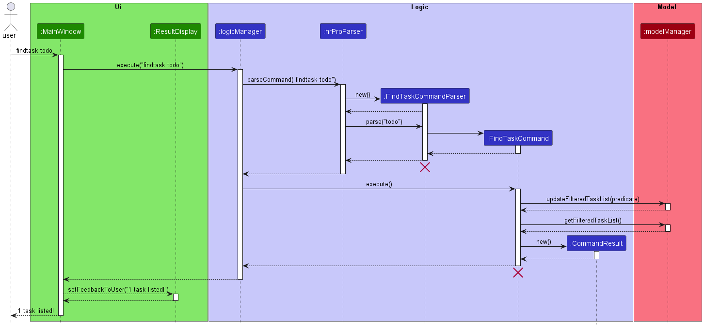

### Design considerations

* We chose to find tasks by their `TaskDescription` as users are more likely to search for tasks by name.
* We allowed for partial matching of the keyword to the `TaskDescription` as users may not remember the full name or a full word of the task.
* Users can find their specific task if their keywords match part of the `TaskDescription`.
    * Pros: Users can find their tasks more easily, especially if they do not know the exact `TaskDescription` of the `Task`
      they want to find.
    * Cons: More tasks will be displayed to the users as there may be more `TaskDescription` that partially matches the keyword.


<div style="page-break-after: always;"></div>

## **Mark and unmark task**

### Implementation
Tasks can be marked as either completed or not completed. The implementation would
be to add a new field `TaskMark` into each `Task` object, with `TaskMark` only accepting a `true` or
`false` value.

The `true` value would mean that the task is marked as completed and the `false` value would
mean that the task is not yet done.

The switching of `true` and `false` values for `TaskMark` will be facilitated using `marktask INDEX` and
`unmarktask INDEX` commands.

* `marktask INDEX` This will mark the `Task` at the specified `INDEX` in the `Task List` as completed.
* `unmarktask INDEX` This will mark the `Task` at the specified `INDEX` in the `Task List` as uncompleted.

The following sequence diagram shows how the mark command will run throughout HR Pro Max++.


### Design Considerations
* We decided to add visual indicators to the `Task` card in the GUI to show the completion status of the `Task`,
so as to make it easier for the user to identify the completion status of the `Task` at a glance.

<div style="page-break-after: always;"></div>

## **Sort task**

### Implementation
Tasks can be sorted by their deadline. The implementation is to add a field `TaskDeadline` into each `Task` object
and only allow the `TaskDeadline` field to accept a `LocalDate` value.

The `LocalDate` is an immutable date-time object that represents a date, often viewed as year-month-day.
The `LocalDate` class has a `compareTo` method that can be used to compare the dates of two tasks.
This method will be used to sort the tasks by their deadline.

* `sorttask` This will sort the `Task` objects in the `Task List` by their deadlines, with the earliest deadline at the top.

The following sequence diagram shows how the `sorttask` command will run throughout HR Pro Max++.

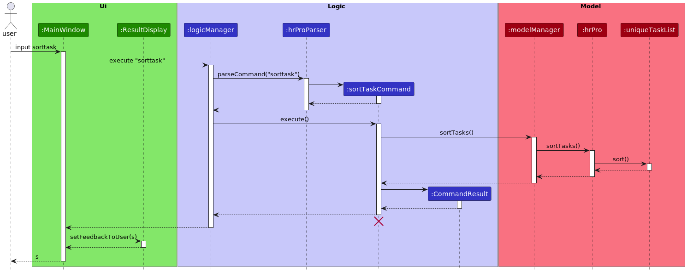

Activity diagram for the sort task command
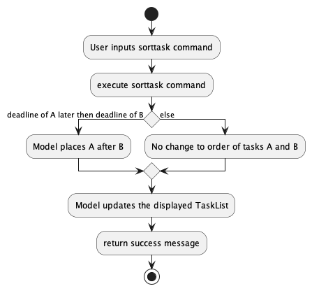

### Design Considerations

* We chose to sort the tasks by their deadlines because it provides the user with more significant information compared to for example, 
sorting tasks by alphabetical order.
* Sorting tasks is an irreversible process. The user will not be able to undo the sorting of tasks.
    * Pros: Less memory required and simpler implementation as there is no need to store the original order of the tasks.
    * Cons: Some users might want to undo the sorting to view the tasks in the original order.

<div style="page-break-after: always;"></div>

## **Delete Staff from a project**

### Implementation

For each Project, there is a Unique Staff list and removing Staff object from this list
will remove Staff that are part of the project. This can be done using a delete command
specifically for staff called `delstaff`. This `Staff` is then deleted.

`delstaff Index pn/PROJECT_NAME ` : Get the Staff name of the Staff on the displayed Staff list identified
by the INDEX. It then deletes the Staff from the Project identified by the PROJECT_NAME if the Staff exists.

To align with the current implementation of deleting from only the displayed Project and Staff list, we
will only allow Staff that are displayed to be deleted. Since we do not save which Project is currently on
display, we pass in the PROJECT_NAME to delete the Staff from the Project identified by the PROJECT_NAME. However, if the Project
with the PROJECT_NAME is not displayed, the Staff cannot be deleted also due to the above-mentioned reason.

`ModelManager` methods for deleting a staff are:
* `getFilteredProjectList` - to check if it is empty
* `getFilteredStaffList` - to check if it is empty
* `getStaffFromProjectAtIndex` - returns an `Optional` which contains either a `Staff` or not
* `getProjectWithName` - return a `Optional` which contains either a `Project` or not, based on PROJECT_NAME
* `isSuccessStaffDelete` - returns a `Boolean` based on whether the `Staff` is deleted from the `Project`

It then checks if the Staff is within the Project's Staff list. If it is, the Staff is deleted and if not, an exception is thrown.

Example Usage:
```
Project list :
1) CS2103T TP
2) CS2102 project
3) Orbital

Staff list:
1) Andy
2) Jayden
3) Shawn
4) Jia Wei
5) Sherwin
```
If the command input is `delstaff 2 pn/CS2102 Project`
Index 2 in this case would refer to Jayden, and then we would find the Staff Jayden
within CS2102 project's Staff list and delete Staff Jayden if they exist.

Exception is thrown for the following cases:
* If the Staff list or Project list is empty (Nothing is displayed).
* If the PROJECT_NAME is for a Project not on display or not in HR Pro Max++.
* If the INDEX is greater than the number of Staff on display currently, or if the INDEX is 0 or negative or exceed INT_MAX.
* If there are any missing parameters.

The activity diagram below shows the logic flow of the `delstaff` command.


### Design Considerations

An alternative implementation of the `delstaff` command could be to implement it in the form `delstaff pn/PROJECT_NAME sn/STAFF_NAME`.
* The `PROJECT_NAME` would then refer to a Project specified by the PROJECT_NAME in the Project List to delete the Staff from.
* The `STAFF_NAME` would then refer to the Staff specified by the STAFF_NAME to delete from the Project's Staff list.
  * Pros: Easier to implement then the current implementation
  * Cons: Does not require Staff to be displayed to be deleted, user would be able to randomly delete Staff, and may lose track of where they are deleting Staff from.

<div style="page-break-after: always;"></div>

## **Add Staff to Project**

### Implementation

The feature to add Staff is facilitated by the `AddStaffCommand`. It extends the `Command` class with functionality
to add a `Staff` to a `Project`, both of which are provided via the `addstaff` command.

The following operations are implemented:
- `execute(Model model)` - Executes an `AddStaffCommand`.

An example of an `AddStaffCommand` is:
`addstaff pn/CS2103T sn/Betsy Crowe sp/1234567 st/Admin Staff sd/Admin sl/false`

The arguments passed into the command are as follows:
- `pn` is the `Project` name of the project to add the staff to.
- `sn` is the name of the `Staff` to add
- `sp` is the phone number of the `Staff`
- `st` is the title of the `Staff`
- `sd` is the department of the `Staff`
- `sl` is the leave status of the `Staff`, which is either `true` or `false`

The usage scenario and how the add staff mechanism behaves is described as following.

Step 1. The user launches the application, and uses the `addStaff` command as described in the UserGuide.
The `HrProParser` calls the `AddStaffCommandParser`, which parses user arguments to create an `AddStaffCommand`.
The `AddStaffCommandParser`, which is a class that extends the `Parser` interface, parses user inputs and creates
two objects, a `ProjectName` object, and a `Staff` object.

Step 2. The `AddStaffCommand` checks if the project exists by checking if the `ProjectName` already exists in
`Model.getFilteredProjectList()`.

Step 3. The method also checks if the `Staff` already exists in the `Project`. If the `Staff` already exists, a `CommandException` is thrown.

Step 4. The `Staff` is added to the `Project`. The `execute()` method updates the `filteredProjectList` before exiting.

Sequence diagram for the execution of `AddStaffCommand`
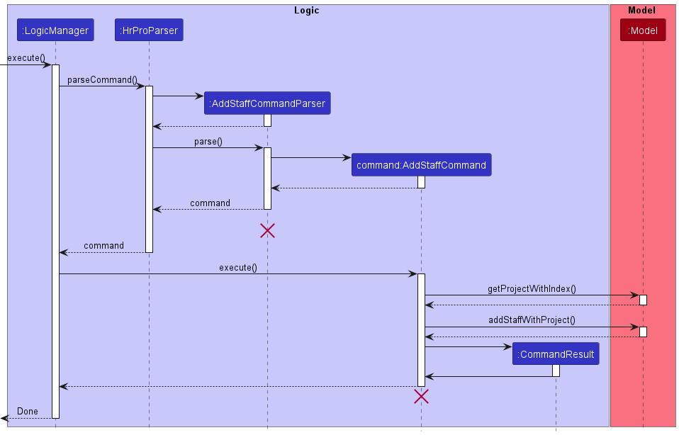

### Design Considerations
**Aspect: Whether to pass `Project` through `Index` or `ProjectName`**
- **Alternative 1**: Users pass in the `Index` of the `Project` in the displayed `ProjectList` (Current Implementation)
  - Pros: This makes an easier command for users to use, since instead of typing `pn/Some Project Name`, users can instead
    just refer to the index of the project in the currently displayed project list.
  - Cons: Users might confuse this command for the `Index` used in the `editstaff` command for instance, since this command
    uses `Index` to represent the index of the project, not the staff.
- **Alternative 2**: Users pass in the `ProjectName` of the `Project`
  - Pros: This solution is more correct and precise, since there is less room for error, in the sense that if a user types
    `pn/Project_A`, then the staff will be added to Project_A (assuming the other checks in the command don't fail).
  - Cons: Users will have to know the full name of the project, and this approach does not allow rooms for typos, so a careless
    user might add a staff member to the wrong project.

<div style="page-break-after: always;"></div>

## **Edit Staff in Project**

### Implementation
The edit staff feature is facilitated by the `EditStaffCommand`. It extends the `Command` class with functionality to 
edit the `Staff` at a certain place in the Staff list belonging to a given `Project`, using the `INDEX` and `ProjectName` provided to the `EditStaffCommand`.
The `Project` must be the `Project` which has its `StaffList` currently displayed in the staff panel.

The following operations are implemented:
- `execute(Model model)` - Executes an `EditStaffCommand`.

An example of a `EditStaffCommand` is:
`editstaff 1 pn/CS2103T sn/John Doe`

The arguments passed into the command are as follows:
- `INDEX` is the `Index` of the `Staff` to be edited.
- `pn` is the `Project` name of the project to add the staff to.
- `sn` is the name of the `Staff` to add
- `sp` is the phone number of the `Staff`
- `st` is the title of the `Staff`
- `sd` is the department of the `Staff`
- `sl` is the leave status of the `Staff`, which is either `true` or `false`

The usage scenario and how the edit staff mechanism behaves is described as following:

Step 1. The user launches the application, and uses the `editStaff` command as described in the UserGuide.
The `HrProParser` calls the `EditStaffCommandParser`, which parses the user inputs to create an `EditStaffCommand`.
The `EditStaffCommandParser`, which is a class that extends the `Parser` interface, parses user inputs into an `Index`,
`ProjectName` and an `EditStaffDescriptor`, which serves as a wrapper class for Staff attributes to be edited.

Step 2. The `execute()` method in `EditStaffCommand` first checks if the passed `ProjectName` is valid, and whether the
`Index` is a valid `Index` of a `Staff` inside the `FilteredStaffList`. This is done by checking if the `Optional`s returned
from `Model.getStaffFromProjectAtIndex()` and `Model.getProjectWithName()` are empty. If they are, a `CommandException` is thrown
for each failed check.

Step 3. A new `Staff` object is created based on the `EditStaffDescriptor`, and is checked with the `Model.projectHasDuplicateStaff()`
to ensure that the new `Staff` object doesn't already exist inside the `FilteredStaffList`.

Step 4. The `Staff` at `Index` inside the `Project` with the given `ProjectName` is edited with the `Model.isSuccessStaffEdit()` method.
If the method returns `false`, it means that editing was not successful since an invalid staff was passed into the `Model`, so
a `CommandException` is thrown.

Sequence diagram for the `EditStaffCommand`
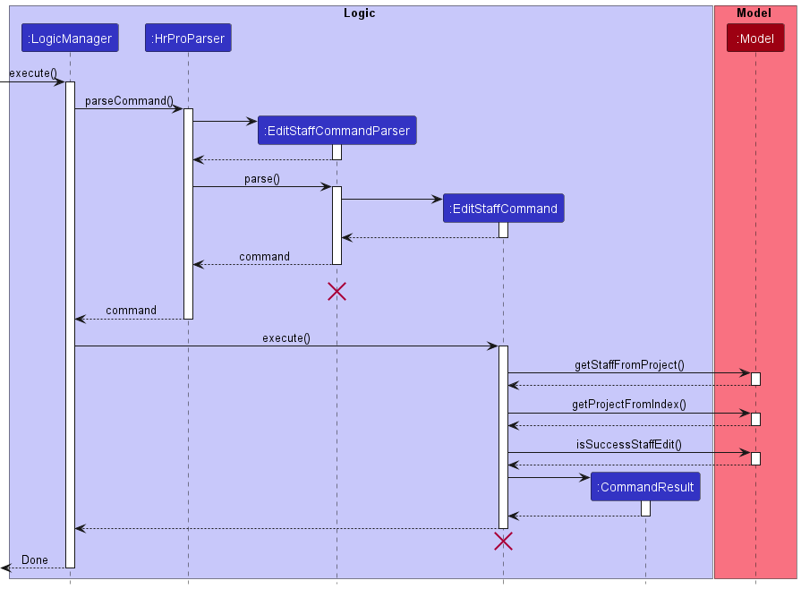

### Design Considerations
**Aspect: Checking if the `Project`'s `Stafflist` is currently displayed**
- **Alternative 1**: `EditStaffCommand` checks if the `Stafflist` of the `Project` whose `Staff` is to be edited is currently displayed (Current Implementation)
  - Pros: Consistent with design philosophy of HR Pro Max++, where any changes are to be directly on the `FilteredStaffList`.
    This approach also forces users to call the `view` command on the `Project` that they want to edit the staff from, which helps to avoid
    errors in editing, since HR Pro Max++ has yet to feature an `undo` command.
  - Cons: Users who are not aware that the `Project` containing the `Staff` to be edited has to have its Staff list displayed using the `view` command,
    might experience errors without an immediately discernible source. The solution the team has come up with is to state explicitly in the User Guide, that
    the `Project` with the `Staff` to be edited in must be the `Project` with its `StaffList` currently displayed in the staff panel.
- **Alternative 2**: `EditStaffCommand` does not check if the `Project` is the currently displayed `Project` list.
    - Pros: Users might have an easier experience with using the command, since they are not required to call `view` before
  `editstaff`. This streamlines the user experience and leads to higher productivity.
    - Cons: Users who are careless might accidentally perform an irreversible edit onto a given staff. Since HR Pro Max++ has yet to
    ship an `undo` command, users might permanently affect the database and if this is a mistake, would be very hard to recover from.

<div style="page-break-after: always;"></div>

## **Find Staff in Project**
### Implementation

The find staff feature is facilitated by the `FindStaffCommand`. It extends the `Command` class with functionality to find a `Staff` within the current
active `Project`, that is, the current `Project` whose `StaffList` is being displayed onto the Staff Panel.
This functionality is provided by the `findstaff` command.

The `FindStaffCommand` has a `Predicate`, which is `StaffNameContainsKeywordsPredicate`. This predicate checks whether
a staff name contains any of the keywords provided to the predicate.

The following operations are implemented:
- `execute(Model model)` - Executes a `FindStaffCommand`.

An example of an `FindStaffCommand` is:
`findstaff Alex Lau`

The arguments passed into the command are as follows:
- `KEYWORD` is a `String` of any keyword the user wants to search within all staff names in the Staff List.

The usage scenario and how the find staff mechanism behaves is described as following.

Step 1. The user launches the application, and uses the `findStaff` command as described in the UserGuide.
The `HrProParser` calls the `FindStaffCommandParser`, which parses user arguments to create a `FindStaffCommand`.
The `FindStaffCommandParser`, which is a class that extends the `Parser` interface, parses user inputs and creates a
`StaffNameContainsKeywordsPredicate`, which is a predicate that checks whether a given `StaffName` contains any one of the
keywords.

Step 2. The `execute()` method of `FindStaffCommand` runs the `StaffNameContainsKeywordsPredicate` on the `FilteredStaffList`.

Step 3. The `FindStaffCommand` updates the `FilteredStaffList` before exiting.

Sequence diagram for the `FindStaffCommand`
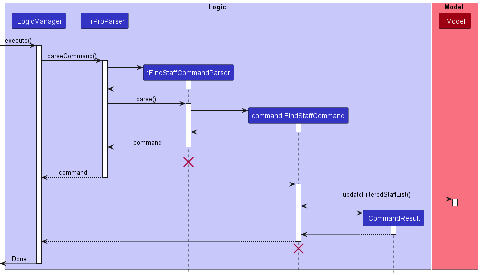

Activity diagram for the `FindStaffCommand`
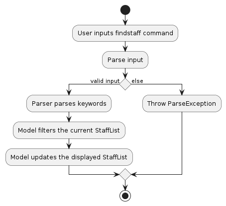

### Design Considerations
**Aspect: Parsing keyword(s) as argument to `FindStaffCommand`**

- **Alternative 1**: Parse based on keywords (Current Implementation)
  - Pros: Allows users to search by multiple keywords, so if a user wants to perform a search query that finds all staff whose names contain one of the keywords,
    this implementation allows them to do so.
  - Cons: Non-standard behaviour when it comes to finding staff, since if the user queries a precise staff name, all staff whose names contain
  even one of the keyword will be listed. For staff lists that may contain multiple staff with the same surname, this affects the effectiveness
  of the command.
- **Alternative 2**: Parse argument as a whole keyword
  - Pros: Allows precise Staff name finding. For instance, if the whole argument is passed as a singular keyword, then doing
  `findstaff Alex Lau` will either return no staff if there is no staff in the staff list with the name "Alex Lau", or only the staff "Alex Lau"
  - Cons: Users who want to perform search queries on the staff list such as finding all Jareds and all Laus, will have to do two separate
  `findstaff` calls when they could just call `findstaff Jared Lau` in an implementation that supports searching multiple keywords.

--------------------------------------------------------------------------------------------------------------------

<div style="page-break-after: always;"></div>

# **Documentation, logging, testing, configuration, dev-ops**

* [Documentation guide](Documentation.md)
* [Testing guide](Testing.md)
* [Logging guide](Logging.md)
* [Configuration guide](Configuration.md)
* [DevOps guide](DevOps.md)

--------------------------------------------------------------------------------------------------------------------
<div style="page-break-after: always;"></div>

# **Appendix: Requirements**

## **Product scope**

**Target user profile**:

HR Pro Max++ aims to help team leads in SMEs to help track and manage their projects, staff members within each project and tasks related to the projects.

Our target users: 
* prefer desktop apps over other types of app
* can type fast and prefer it over mouse interactions
* are reasonably comfortable using CLI apps
* need to oversee many projects
* need to track staff members who are part of each project
* need to record project details for easy access in the future
* need to contact their team members
* need to record tasks to track their workload

**Value proposition**:
* For many SMEs, a problem they face when setting up their business is a lack of a database to help
them track their business operations. This can result in inefficiency in their operations if they are not
kept up to date of the latest project information or do not know who to contact. Therefore, we created
HR Pro Max++ to be a free, easy and comprehensive employee and project management application.
* For SMEs to earn profit, they would have to engage in many projects, so they can record the project details
in our application to keep track of them.
* Team leads can also record which team members are involved with what project so that they will
know who to find and how to contact them.
* Team leads can record down different tasks that need to be done for their various projects


<div style="page-break-after: always;"></div>

## **User stories**

Priorities: High (must have) - `* * *`, Medium (nice to have) - `* *`, Low (unlikely to have) - `*`

| Priority | As a …​   | I want to …​                                   | So that I can…​                                 |
|----------|-----------|------------------------------------------------|-------------------------------------------------|
| `* * *`  | team lead | view the projects I am working on              | view my workload                                |
| `* * *`  | team lead | add deadline to projects                       | know when I need to finish                      |
| `* * *`  | team lead | record down tasks to do                        | track my remaining tasks                        |
| `* * *`  | team lead | delete projects that are done or cancelled     | remove unnecessary information                  |
| `* * *`  | team lead | edit project details                           | update project with the newest information      |
| `* * *`  | team lead | add staff to a project                         | track who is working on each project            |
| `* * *`  | new user  | record staff details one at a time             | ensure that I will not make any mistakes        |
| `* * *`  | team lead | add budget to a project                        | ensure that I will not exceed the budget        |
| `* * *`  | team lead | access my members' departments                 | easily see who to contact                       |
| `* * *`  | team lead | access my members' titles                      | keep track of their job scope                   |
| `* * *`  | team lead | access my members' contacts from staff details | easily communicate with them                    |
| `* * *`  | team lead | keep track of my staff leave status            | know who is currently available                 |
| `* * *`  | team lead | keep track of staff names                      | know the people I am leading                    |
| `* * *`  | team lead | delete staff members from a project            | track who is working on each project            |
| `* * *`  | team lead | view the staff of a project                    | easily know who is working on the project       |
| `* * *`  | team lead | edit the staff detail of a project             | keep up to date on my staff information         |
| `* * *`  | team lead | delete task from task list                     | remove mistakenly added tasks                   |
| `* * *`  | team lead | edit name for a task                           | keep it updated with the latest information     |
| `* * *`  | team lead | mark task as complete                          | record that I have finished it                  |
| `* * *`  | team lead | mark task as incomplete                        | unmark tasks that I accidentally marked as done |
| `* *`    | team lead | find staff in a project                        | check if someone is involved in the project     |
| `* *`    | team lead | sort projects by deadline                      | know which projects are due soonest             |
| `* *`    | team lead | find task by name                              | find out more information about the task        |
| `* *`    | team lead | sort task by deadline                          | know which task is more urgent                  |
| `* *`    | team lead | sort task by completetion status               | see all my remaining tasks that have to be done |
<div style="page-break-after: always"></div>
## **Use cases**

(For all use cases below, the **System** is the `HR Pro Max++` and the **Actor** is the `user`, unless specified otherwise)

### Use case: UC01- Add a project

**MSS**

1. User requests to add project.
2. HR Pro Max++ records the project details and display added project.

   Use case ends.

**Extensions:**

* 1a. HR Pro Max++ detects error in add project command.
    * 1a1. HR Pro Max++ shows error

      Use case resumes at step 1.

### Use case: UC02- Add staff member to project

**MSS**

1. User requests to list all current projects.
2. HR Pro Max++ shows a list of all projects.
3. User requests to add a staff member to a specific project in the list.
4. HR Pro Max++ displays staff member added and stores them.

   Use Case ends.

**Extensions:**
* 2a. The list is empty.

  Use case ends.

* 3a. The given index is invalid.

    * 3a1. HR Pro Max++ shows an error message.

      Use case resumes at step 2.

### Use case: UC03- Delete a Project

**MSS**

1.  User requests to list projects.
2.  HR Pro Max++ shows a list of projects.
3.  User requests to delete a specific project in the list.
4.  HR Pro Max++ deletes the project.

    Use case ends.

**Extensions**

* 2a. The list is empty.

  Use case ends.

* 3a. The given index is invalid.

    * 3a1. HR Pro Max++ shows an error message.

      Use case resumes at step 2.


### Use case: UC04- Edit Project details

**MSS**

1. User adds a project(UC01).
2. User requests to edit the project in Project list with new arguments.
3. HR Pro Max++ records the change in local storage and display project with updated details.

   Use case ends.

### Use case: UC05- Edit Staff details

**MSS**

1. User adds staff to project(UC02).
2. HR Pro Max++ displays staff member added and stores them.
3. User realises staff detail is wrong.
4. User deletes staff detail.
5. User adds staff with updated detail.
6. HR Pro Max++ displays updated staff member added and stores them.

    Steps 3-6 are repeated until staff member detail is correct.

**Extensions:**

* 1a. The given project is invalid.
    * 1a1. HR Pro Max++ shows error.

      Use case resumes at step 1.
* 4a. The given project is invalid.
    * 4a1 HR Pro Max++ shows error.

      Use case resumes at step 4.
* 4b. The given staff is invalid.
    * 4b1 HR Pro Max++ shows error.

      Use case resumes at step 4.
* 5a. The given project is invalid.
    * 5a1. HR Pro Max++ shows error.

      Use case resumes at step 5.

### Use case: UC06- View Staff details

**MSS**

1. User adds staff to project(UC02).
2. User requests to view staff details.
3. HR Pro Max++ displays staff details.

   Use case ends.

**Extensions:**

* 1a. The given project is invalid.
    * 1a1. HR Pro Max++ shows error.

      Use case resumes at step 1.
* 2a. The given project is invalid.
    * 2a1. HR Pro Max++ shows error.

      Use case resumes at step 2.

### Use case: UC07- Find staff in project

**MSS**

1. User adds staff to project(UC02).
2. User requests to view staff details(UC06).
3. HR Pro Max++ displays staff details.
4. User requests to find a specific staff.
5. HR Pro Max++ displays staff details.

   Use case ends.

**Extensions:**

* 1a. The given project is invalid.
    * 1a1. HR Pro Max++ shows error.

      Use case resumes at step 1.
* 2a. The given project is invalid.
    * 2a1. HR Pro Max++ shows error.

      Use case resumes at step 2.
* 4a. The given staff does not exist.
    * 4a1. HR Pro Max++ does not display any staff.

      Use case ends.


<div style="page-break-after: always;"></div>

## **Non-Functional Requirements**
1. Should work on any _mainstream OS_ as long as it has Java `11` or above installed.
2. Should be able to run without any additional installations beyond Java 11.
3. Should be able to hold up to 1000 projects without a noticeable sluggishness in performance for typical usage.
4. A user with above average typing speed for regular English text (i.e. not code, not system admin commands) should be able to accomplish most of the tasks faster using commands than using the mouse.
5. User data should be stored locally in a text file and should be human editable.
6. The application should be able to handle invalid inputs and recover from them.
7. Commands should be able to be executed in a case-insensitive manner.
8. The application should be able to run without an internet connection.
9. Parameters for commands should be able to be in any order.
10. The application should be delivered to the user as a single JAR file.
11. The application should be optimised for a single user.
12. The user should be able to use the application without any prior knowledge of the application with the help of the User Guide.
13. The fields in the GUI should be able to be resized to fit the user's screen.
14. The fields in the GUI should be clearly labelled such that the user can easily understand what they are for.
15. The User Guide and Developer Guide should be clearly written and easy to understand.

<div style="page-break-after: always;"></div>

## **Glossary**

* **Mainstream OS**: Windows, Linux, Unix, OS-X
* **SME** Small and medium-sized enterprises, business whose personnel fall below certain limits
* **Team lead/ Team leader** Someone leading a group of other staff members within the SME
* **GUI** A Graphical User Interface (GUI) is a visual way of interacting with a computer using items such as windows, icons, and menus.
* **CLI** A Command Line Interface (CLI) is a way of interacting with a computer by typing commands into a text interface.
* **JAR** Stands for Java Archive, and is a file format used to aggregate many Java class files and associated metadata and resources (text, images, etc.) into one file for distribution.
* **Prefix** A prefix is a short string of characters that is used to identify a command parameter. It is always ended by a backslash (`/`).
* **Parameter** A parameter is a value in a command that is used to specify the behaviour of the command. Parameters are information to be supplied by the user.

--------------------------------------------------------------------------------------------------------------------
<div style="page-break-after: always;"></div>

# **Appendix: Instructions for manual testing**

Given below are instructions to test the app manually.

<div markdown="span" class="alert alert-info">:information_source: **Note:** These instructions only provide a starting point for testers to work on;
testers are expected to do more *exploratory* testing.

</div>

## Launch and shutdown

1. Initial launch

   1. Download the jar file and copy into an empty folder

   1. Double-click the jar file Expected: Shows the GUI with a set of sample data. The window size may not be optimum.

1. Saving window preferences

   1. Resize the window to an optimum size. Move the window to a different location. Close the window.

   1. Re-launch the app by double-clicking the jar file.<br>
       Expected: The most recent window size and location is retained.


<div style="page-break-after: always;"></div>

## Deleting a Project

1. Deleting a Project while all Projects are being shown

   1. Prerequisites: List all Projects using the `list` command. Multiple Projects in the list.

   2. Test case: `delproj 1`<br>
      Expected: First Project is deleted from the list. Details of the deleted Project shown in the Result Display.

   3. Test case: `delproj 0`<br>
      Expected: No Project is deleted. Error details shown in the Result Display.

   4. Other incorrect delete commands to try: `delproj`, `delproj x`, `...` (where x is larger than the list size)<br>
      Expected: Similar to previous.

   5. Command should be case-insensitive. Other correct delete commands to try: `DELPROJ 1`, `delProj 1`, `dELproJ 1`<br>
      Expected: Similar to first test case.

## Sorting Projects by deadline

1. Sorting Projects by deadline

    1. Prerequisites: Multiple projects in the list.

    2. Test case: `sortproj`<br>
       Expected: Projects are sorted by deadline with the earliest deadline at the top.

    3. Test case: `sortproj 0`<br>
       Expected: Projects are sorted by deadline with the latest deadline at the top.

    5. Command should be case-insensitive and ignore extra input following the command word. Other correct sort commands to try: `SORTPROJ`, `sortProj xsf01`, `sortproj vfdwl`<br>
       Expected: Similar to first test case.

    6. `sortproj` should work on all Projects even if the Project list has been filtered using `findproj` command.

<div style="page-break-after: always;"></div>

## Viewing the Staff list of a Project

1. Viewing the Staff list while all projects are being shown

    1. Prerequisites: List all projects using the `list` command. Multiple projects in the list.

    2. Test case: `view 1`<br>
       Expected: Staff list of the first Project in the list is displayed. Success message shown in the Result Display.

    3. Test case: `view 0`<br>
       Expected: No Staff list is shown. Error details shown in the Result Display.

    4. Other incorrect view commands to try: `view`, `view x`, `...` (where x is larger than the list size)<br>
       Expected: Similar to previous.

2. Viewing the Staff list while only some projects are being shown

   1. Prerequisites: Find projects using the `find` command such that only some projects are shown in the list.

   2. Test case: `view 1`<br>
      Expected: Staff list of the first Project in the list is displayed. Success message shown in the Result Display.

   3. Test case: `view 0`<br>
      Expected: No Staff list is shown. Error details shown in the Result display.

   4. Other incorrect view commands to try: `view`, `view x`, `...` (where x is larger than the list size)<br>
      Expected: Similar to previous.

<div style="page-break-after: always;"></div>

## Marking a Task

1. Marking a task in an unsorted Task list

    1. Prerequisites: List all Tasks using the `list` command. Multiple Tasks in the list.

    2. Test case: `marktask 1`<br>
       Expected: First Task is marked as completed. Success message shown in the Result Display.

    3. Test case: `delproj 0`<br>
       Expected: No Task is marked. Error details shown in the Result Display.

    4. Other incorrect mark commands to try: `marktask`, `marktask x`, `...` (where x is larger than the list size)<br>
       Expected: Similar to previous.

    5. Command should be case-insensitive. Other correct mark commands to try: `MARKTASK 1`, `markTask 1`, `MarkTask 1`<br>
       Expected: Similar to first test case.

2. Marking a task in a sorted Task list

    1. Prerequisites: List all Tasks using the `list` command. Multiple Tasks in the list. Sort the Task list using the `sorttask` or `sortcomplete` command.

    2. Test case: `marktask 1`<br>
       Expected: First Task is marked as completed. Success message shown in the Result Display.

    3. Test case: `delproj 0`<br>
       Expected: No Task is marked. Error details shown in the Result Display.

    4. Other incorrect delete commands to try: `marktask`, `marktask x`, `...` (where x is larger than the list size)<br>
       Expected: Similar to previous.

    5. Command should be case-insensitive. Other correct mark commands to try: `MARKTASK 1`, `markTask 1`, `MarkTask 1`<br>
       Expected: Similar to first test case.

3. Marking a Task in a filtered Task list

    1. Prerequisites: Filter the Task list using the `findtask` command such that at least 1 Task is left in the list.

    2. Test case: `marktask 1`<br>
       Expected: First Task in the filtered list is marked as completed. Success message shown in the Result Display.

    3. Test case: `marktask 0`<br>
       Expected: No Task is marked. Error details shown in the Result Display.

    4. Other incorrect mark commands to try: `marktask`, `marktask x`, `...` (where x is larger than the list size)<br>
       Expected: Similar to previous.

    5. Command should be case-insensitive. Other correct mark commands to try: `MARKTASK 1`, `markTask 1`, `MarkTask 1`<br>
       Expected: Similar to first test case.

<div style="page-break-after: always;"></div>

## Unmarking a Task

1. Unmarking a task in an unsorted Task list

    1. Prerequisites: List all Tasks using the `list` command. Multiple Tasks in the list. Tasks should be marked as completed.

    2. Test case: `unmarktask 1`<br>
       Expected: First Task is marked as not completed. Success message shown in the Result Display.

    3. Test case: `unmarktask 0`<br>
       Expected: No Task is unmarked. Error details shown in the status message.

    4. Other incorrect unmark commands to try: `unmarktask`, `unmarktask x`, `...` (where x is larger than the list size)<br>
       Expected: Similar to previous.

    5. Command should be case-insensitive. Other correct unmark commands to try: `unMARKTASK 1`, `unmarkTask 1`, `unMarkTask 1`<br>
       Expected: Similar to first test case.

2. Unmarking a task in a sorted Task list

    1. Prerequisites: List all Tasks using the `list` command. Multiple Tasks in the list. Sort the Task list using the `sorttask` or `sortcomplete` command. Tasks should be marked as completed.

    2. Test case: `unmarktask 1`<br>
       Expected: First Task is marked as not completed. Success message shown in the Result Display.

    3. Test case: `unmarktask 0`<br>
       Expected: No Task is unmarked. Error details shown in the Result Display.

    4. Other incorrect delete commands to try: `unmarktask`, `unmarktask x`, `...` (where x is larger than the list size)<br>
       Expected: Similar to previous.

    5. Command should be case-insensitive. Other correct unmark commands to try: `unMARKTASK 1`, `unmarkTask 1`, `unMarkTask 1`<br>
       Expected: Similar to first test case.

3. Unmarking a Task in a filtered Task list

    1. Prerequisites: Filter the Task list using the `findtask` command such that at least 1 Task is left in the list. Tasks should be marked as completed.

    2. Test case: `unmarktask 1`<br>
      Expected: First Task in the filtered list is marked as not completed. Success message shown in the Result Display.

    3. Test case: `unmarktask 0`<br>
      Expected: No Task is unmarked. Error details shown in the status message.

    4. Other incorrect unmark commands to try: `unmarktask`, `unmarktask x`, `...` (where x is larger than the list size)<br>
      Expected: Similar to previous.

    5. Command should be case-insensitive. Other correct unmark commands to try: `UNMARKTASK 1`, `unmarkTask 1`, `unMarkTask 1`<br>
      Expected: Similar to first test case.

<div style="page-break-after: always;"></div>

## Finding a Task

1. Finding a Task while all Tasks are being shown

   1. Prerequisites: List all Tasks using the `list` command. Multiple Tasks in the list.

   2. Test case: `findtask download`<br>
      Expected: Only Tasks with names containing `download` are shown. Number of Tasks being listed is displayed in the Result Display.

   3. Test case: `findtask`<br>
      Expected: No Tasks are shown. Error details shown in the Result Display.

   4. Command should be case-insensitive and allow for partial matching. Other correct find commands to try: `FINDTASK download`, `findtask down`, `FindTask d`<br>
      Expected: Similar to first test case.

2. Finding a Task while only some Tasks are being shown

   1. Prerequisites: Filter the Task list using the `findtask` command such that at least 1 Task is left in the list.

   2. Test case: `findtask download`<br>
      Expected: Only Tasks with names containing `download` are shown. Tasks not initially displayed that exist in the app
      and contain `download` should be displayed as well. Number of Tasks being listed is displayed in the Result Display.

   3. Test case: `findtask`<br>
      Expected: No Tasks are shown. Error details shown in the Result Display.

   4. Command should be case-insensitive and allow for partial matching. Other correct find commands to try: `FINDTASK download`, `findtask down`, `FindTask d`<br>
      Expected: Similar to first test case.

<div style="page-break-after: always;"></div>

## Sorting Tasks by completion status

1. Sorting Tasks by completion status

    1. Prerequisites: Multiple Tasks in the list. Tasks should be marked as completed and not completed.

    2. Test case: `sortcomplete`<br>
       Expected: Tasks are sorted by completion status. Tasks that are not completed are shown first. Success message shown in the Result Display.

    3. Test case: `sortcomplete 0`<br>
       Expected: Tasks are sorted by completion status. Tasks that are not completed are shown first. Success message shown in the Result Display.

    4. Command should be case-insensitive and ignore extra input following the command word. Other correct sort commands to try: `SORTCOMPLETE`, `sortComplete xs01`, `sortcomplete vfdwl`<br>
       Expected: Similar to first test case.

    5. `sortcomplete` should work on all Tasks even if the Task list has been filtered using `findproj` command.

## Saving data

1. Dealing with missing/corrupted data files

   1. Test case: Delete the data file directly (for example, by deleting the `hrpro.json` file)<br>
      Expected: HR Pro Max++ launches with no data. Restarting the app should create a new data file with the sample data.

   2. Test case: Add invalid characters such as `^` to the data file directly (for example, by editing the `hrpro.json` file)<br>
      Expected: HR Pro Max++ launches with no data. Any further changes you make (eg: adding a Project) will be reflected in the new data file.

<div style="page-break-after: always"></div>

# **Appendix: Effort**

We felt that our group has placed more than the average effort needed into this group project, just in case.

The initial AB3 had only `Person`, however our group refactored `Person` into `Project` and from there added `Staff` into each project,
and a `Task`. While the `Task` is quite similar to the `Person` in terms of implementation for model and logic component, the difficulty for both
lay within making the regex for their fields. `TaskMark`, `Deadline` and `Tag`, required us to do some reading up on how the regex API works, and for `Deadline`,
initially we tried to do it using Java regex but decided to change our implementation to use Java's `LocalDate`, which we also had to read up on to figure out how to use.

The biggest challenge for the project was implementing `Staff` and everything related to it. `Staff` existed as a `UniqueStaffList` within `Project`, which was something we could not reference from `Person`.
We had many considerations for the implementation, perhaps wanting to save it independently from `Project` and to instead save a list of
`Project` within each `Staff`. This caused many days of debate on the implementation. Such implementation also affected how it worked when it came to UI and the logic for the commands.
For `Staff` related commands, we had to switch between many implementations, whether we changed the parameters passed or changed the way it was stored and reference to in modelManager. One other
implementation was not to use a filterStaffList, but instead a targetProject field, which had us needing to change how storage and UI would work. Due to the difficulty of this, we could easily take a few days
every week, contemplating on how `Staff` and its related commands should work, be implemented, and then implement them.

For logic, we added many commands. Some of them like `taskMark`, `sortProj`, and `view` to name a few required us to understand how `modelManager`,
the old `addressBook` worked before we could try to create these commands. We had to consider how to write the logic that follows OOP standards from scratch
and had to read Java API such as for `Optional` and `Comparator` to reach a satisfactory implementation.

For the UI, we wanted a design that made us different from AB3, even if just a little. Our group has never worked with CSS files before or JavaFx, so we
had to experiment for ourselves, searching for help through API and suggestion offered online. We tried using VBox and HBox to fit our design but ultimately changed
to `splitpane` when our dimensions were wrong. We had to learn how the different attributes in fxml and CSS worked, if we wanted to increase the number of fields displayed,
change to different colours and also how to make a `flowpane` display different colours based on different conditions. All of these changes took lots of time
and even back in V1.2, we nearly could not finish by the deadline since we could not figure out how to fix some bugs with the UI.

With storage, we also did not have experience with JSON files, and had to learn how they were created and saved using the original for `Person`.
We had much difficulty as we wanted `Project` to store a list of `Staff` objects but were unsure how to do it. Unlike the `Tag`, each `Staff` also had its
own fields to save and load, and due to that we had to experiment for numerous days till we saved it.

For the test cases, we started them since V1.2, and faced many challenges when having to deal with the many Stubs used and also just the general
difficulty of writing good test cases. We have been doing test cases for every command made, every addition to model and have been aiming to ensure that we
keep our code coverage at 75% and above. The biggest challenge was writing test cases for `Staff` since the original stubs used were not applicable as `Staff` cannot
exist without a `Project`, a dependency that `Person` did not have. Therefore, we could not refer to anything and had to create one for testing purposes.
